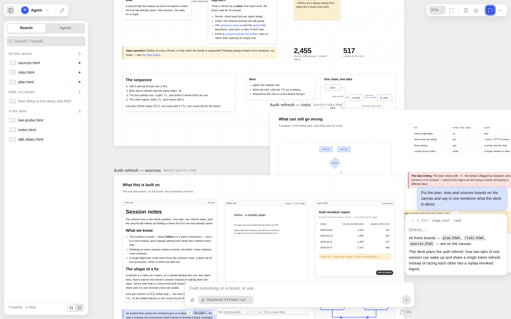

# Decks

**A canvas-centric coding agent.** Boards are local HTML files of absolutely-positioned
components, laid out on an infinite stage you pan and zoom. The agent writes them with its
ordinary tools, and you drag, resize and retype them. The conversation floats at the edge.

[](https://github.com/DotIN13/decks/actions/workflows/test.yml)



## What it is

A chat scrolls away. A board stays where it was put, so it can hold a plan while you argue
with the plan, and it can still be there an hour later. So the agent answers on a board, lays
designs out on boards, and reports finished work on boards, while the chat column stays what
it is good at: a pointer to the board and a question it cannot answer alone.

Because a board is a plain HTML file, this is not a proprietary document format. You can read
it, edit it, diff it, and open it in a browser with Decks not running. Boards are also what
passes between agents: a subagent is handed the *source* of the boards it was given, not a
summary of them.

It is built for one person on one machine. That is a design constraint rather than a stage it
is passing through, and it is why the server has no authentication and why the agent runs
with real tools. Read [Security](#security) before you put it anywhere.

## Quick start

```bash
git clone https://github.com/DotIN13/decks.git
cd decks
npm ci
npm run dev          # API on 127.0.0.1:4329, Vite on 127.0.0.1:4328
```

Open the Vite URL. The first run creates an empty deck and shows you a blank canvas; ask the
agent for something and the first board appears on it. `npm run dev:example` uses the
committed demo deck instead of your own.

## Requirements

- **Node.js >= 22.19.** Node 22.18 is where it strips TypeScript types by itself, which is
  how parts of this repository run with no build step at all.
- **A model.** Decks reads the same `~/.pi/agent/` the Pi CLI uses, so `pi auth` once is
  enough, or set `ANTHROPIC_API_KEY` / `OPENAI_API_KEY` in the environment. Without
  credentials the canvas, the boards and the editor all still work; only the agent does not.
- **Chromium**, for the browser checks and for the agent's own board-debugging skill:
  `npx playwright install chromium`.

## What it does

- **Boards are files.** `boards/*.html`, absolutely positioned, rendered on an infinite
  canvas. The agent writes them with its ordinary tools; you drag, resize, retype and insert
  with a palette. Both edits land in the same file, and a drag rewrites exactly one attribute.
- **New boards are blank, and nine examples ship with the app.** `stage.newBoard({ title })`
  writes a heading and an import map and nothing else, in every format. The examples (three
  for coding, three for research, three for business, using d3, three.js, GSAP and Chart.js)
  are copied into every deck's `examples/` on start, to borrow structure from rather than to
  be created from.
- **Most of a board is editable by hand.** Double-click any run of words the board named and
  retype it in place; a markdown or Mermaid component opens its whole source. The selection
  gets an inspector: what kind of box it is, its tone, what an embed points at, its name and
  its order. Every change lands as a splice of the lines it named, so the file an agent reads
  back is still one it recognises.
- **One tool for the canvas.** `stage_eval` runs TypeScript against a typed API
  ([runtime/stage.d.ts](runtime/stage.d.ts), injected into the agent's context verbatim):
  start a board, put boards in play, hold others in context, rearrange, name itself, draw its
  own avatar, hand work to a subagent.
- **Embeds.** A board can show your real documents: markdown, PDF with page ranges, HTML,
  images, plain text and source, from the deck or from a root its `deck.json` declares.
  Anything a board cannot draw becomes a chip naming the file, its size and its kind.
- **Drag files in.** Drop files from your desktop onto a board and they land as embeds where
  you dropped them. The bytes are copied into the deck's `assets/`, because a deck is
  self-contained and an embed of your desktop is a board that breaks when you tidy up.
  Identical files are stored once and nothing is overwritten.
- **And it works under a finger.** Two fingers pan and pinch, over the boards as well as
  between them; one finger pans and a tap selects. The panels become sheets you open from the
  title bar, and the chrome grows to fingertip size.
- **Two runtimes.** An agent runs on [Pi](https://github.com/earendil-works/pi) or on Claude
  Code, chosen when you create it and fixed for its life. `DECKS_BACKEND=pi|claude` sets what
  the `+` button gives you. A Claude agent needs Claude Code on `PATH`, or
  `DECKS_CLAUDE_PATH` pointing at it.
- **Agents are a chat list.** Each has the name it chose and the face it drew. Subagents are
  rows too, tagged with their parent, and they report back into the conversation that asked.
- **A time machine.** Hover the timeline to see the boards as they were at that point in the
  conversation; click to rewind, and restore the boards only if you ask.

## Where things are kept

One directory holds everything, and the deck is `decks/` inside it:

```
$DECKS_DATA_DIR/          default ~/.decks · `npm run dev` uses <repo>/data
  decks/
    deck.json             the deck's name, and the roots its embeds may reach
    boards/*.html         the boards
    examples/             the nine worked examples, refreshed from the build on start
    lib/                  the primitives, copied in so a board renders on its own
    assets/               images the boards use, and the files you drop on them
    .decks/               revisions and agent avatars, never served except by hash
```

One deck per data directory, because a deck is a working directory: Pi keys a session's
transcripts to the path it ran in, so "which deck" and "which history" are one choice. Switch
by pointing somewhere else: `npm start -- ~/other-data`, or `DECKS_DATA_DIR`.

**The transcripts are not in the deck.** They belong to Pi, under
`~/.pi/agent/sessions/<slug of the deck path>/`, so moving a deck leaves its conversations
behind unless you copy that directory too. Boards, their revisions and their arrangement all
travel with the folder.

| variable | |
|---|---|
| `DECKS_DATA_DIR` | the directory above. A positional argument beats it: `npm start -- ~/other` |
| `DECKS_HOST` / `DECKS_PORT` | default `127.0.0.1:4329` |
| `DECKS_BACKEND` | `pi` (default) or `claude`: what a new agent runs on |

## The repository

| | |
|---|---|
| `apps/server` | the shell: the deck, the frame router (`wire/`), board writes (`boards/service.ts`), the agents (`agents/`), the canvas tool (`stage/`) and one directory per runtime (`runtimes/`) |
| `apps/web` | the browser: the stage and its gestures (`canvas/`, `camera/`), the conversation (`chat/`), the chrome (`chrome/`) and the stores (`state/`) |
| `packages/protocol` | every frame and every shape both sides must agree on, split by subject |
| `packages/board-kit` | the board vocabulary as data: the classes, the tones, the kinds a palette can place |
| `packages/web-gate` | the gate a browser agent drives a real Chrome through: a DevTools proxy that holds anything that sends, or that would type words of its own |
| `runtime/` | what the agents' runtimes read: the board primitives, the skills, the example boards, the canvas API, the tool's own words, and the shims for the runtimes outside this process |
| `extension/` | the Chrome extension that shares one of your tabs with a deck |
| `e2e/` | the browser checks, driven with Playwright over a throwaway copy of `example/` |
| `docs/` | the design document, the deployment guide, and the landing page |

## Development

```bash
npm test              # the unit tests for every workspace, no model needed
npm run test:e2e      # the browser checks, ~2 min over a throwaway copy of example/
npm run typecheck     # every workspace, including the extension and the browser checks
npm run vendor        # re-copy the board primitives into runtime/lib
```

`test:e2e` runs the checks that need no model; `DECKS_E2E_AGENT=1 npm run test:e2e` adds the
ones that prompt an agent, which spend tokens and are deliberately not part of CI. The runner
refuses to start if something is already on the API port, so a stale dev server cannot make a
run report a result about a deck nobody meant to touch.

`example/` is a committed data directory: `example/decks` is the demo deck and
`example/shared` is the out-of-deck file its sources board embeds, which is the only thing in
the repository that exercises the quarantine path end to end. Its `decks/lib` is generated
rather than committed: opening a deck refreshes its primitives, so a fresh clone gets one on
the first `npm run dev:example`.

See [CONTRIBUTING.md](CONTRIBUTING.md) before you send a change; it is short, and the two
things it asks for are a test that can fail and a comment that explains why.

## Documentation

- [docs/DESIGN.md](docs/DESIGN.md) — what the thing is and why it is that way, section by
  section. The reasoning, not the API.
- [docs/DEPLOYMENT.md](docs/DEPLOYMENT.md) — running a deck on a machine other than the one
  you are sitting at, starting with the fact that Decks has no authentication.
- [e2e/README.md](e2e/README.md) — what the browser checks cover, what they deliberately do
  not, and how to write one.
- [docs/index.html](docs/index.html) — the landing page, if you want a one-page version to
  send to somebody.

## Security

Decks runs an agent with live shell and file tools, and the server has no authentication: a
reachable port is code execution as the user running it. **Bind it to loopback and reach it
over a private network.** [docs/DEPLOYMENT.md](docs/DEPLOYMENT.md) §1 is the long version and
governs everything else about a deployment.

To report a vulnerability, use GitHub's private reporting (Security → Report a vulnerability)
rather than a public issue. [SECURITY.md](SECURITY.md) says what is in scope and what is a
deliberate design choice.

## License

MIT. See [LICENSE](LICENSE).
